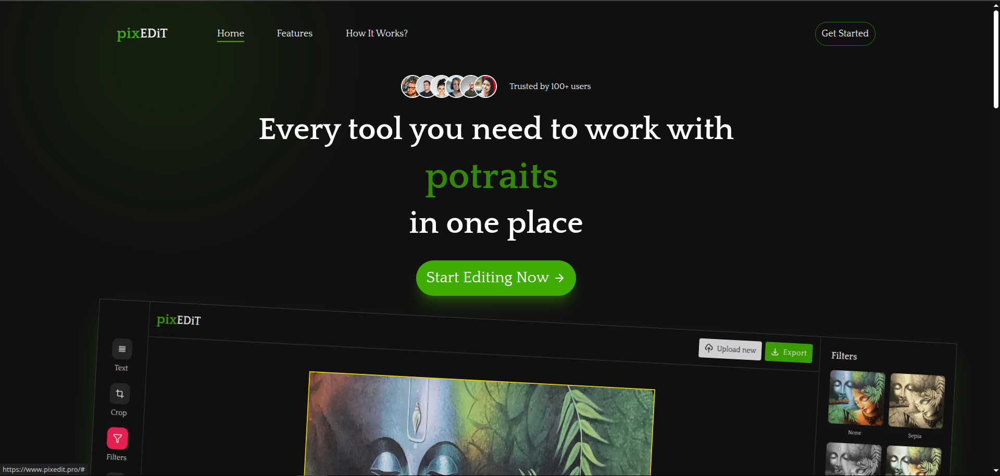
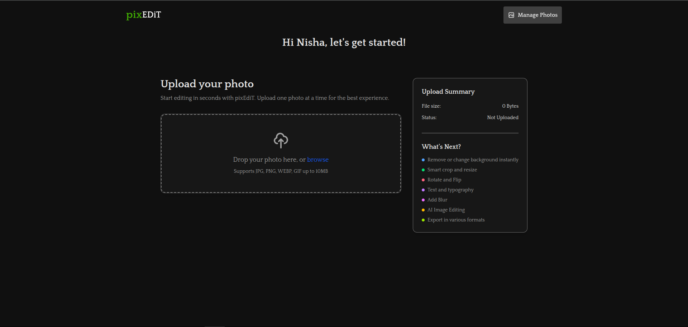
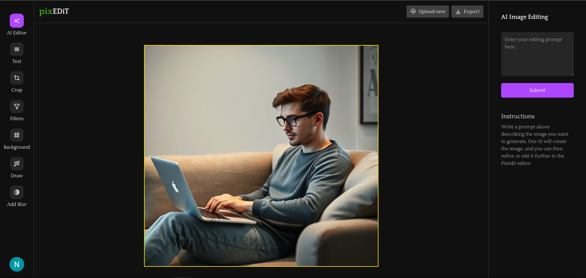

# 🖼️ Pixedit

#### Pixedit is a complete image editing solution that lets you remove or change backgrounds instantly, crop and resize with precision, rotate and flip with ease, add stylish text and typography, apply blur effects for depth, generate and refine visuals with AI, and finally export in multiple formats — everything you need to edit, design, and transform your images effortlessly.








---

## ✨ Key Features
🔵 **Remove or Change Background Instantly** – Quickly replace, remove, or edit backgrounds with AI precision.  

🟢 **Smart Crop and Resize** – Adjust image dimensions effortlessly while keeping quality intact.  

🔴 **Rotate and Flip** – Transform images with rotation and flipping options.  

🟣 **Text and Typography** – Add stylish text overlays with customizable fonts and colors.  

🟡 **Add Blur** – Apply blur effects selectively for depth and focus.  

🟠 **AI Image Generate and Edit** – Create images from prompts and refine them directly in the editor.  

⚫ **Export in Various Formats** – Save and share your creations in multiple file formats.  

## 🎥 Demo Video
[](https://www.youtube.com/watch?v=2ojFEbT6RPQ&t=43s)  
*(Replace with your actual demo link when ready)*  

---

## 🛠️ Tech Stack

Pixedit is built with a modern and scalable stack to ensure performance, reliability, and smooth user experience:

⚡ Next.js – React framework for server-side rendering and fast builds

🎨 Tailwind CSS – Utility-first styling for responsive and sleek UI

🗄️ Prisma – Next-generation ORM for database management

🔒 Next-Auth – Secure and flexible authentication

📦 Zustand – Lightweight state management

🧑‍💻 TypeScript – Type-safe development for scalability and maintainability


## 🚀 Getting Started

Run Pixedit locally and start exploring all its image editing features in just a few steps.

### Prerequisites
 
#### Installation & Setup

1. Clone the repository

   ``` 
   https://github.com/nissha29/PixEdit.git
   ```

2. Navigate into the project folder
  
     ```
     cd pixedit
     ```

3. Install dependencies
   
     ```
     npm install
     ```

4. Start the development server
    
    ```
    npm run dev
    ```

5. Open the app in your browser

    Visit http://localhost:3000 to see Pixedit in action.

